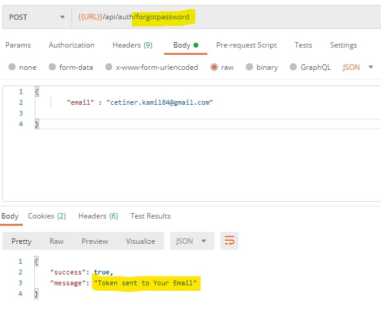
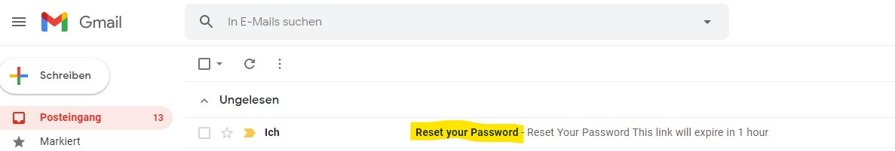
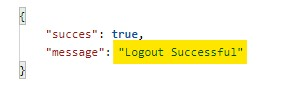
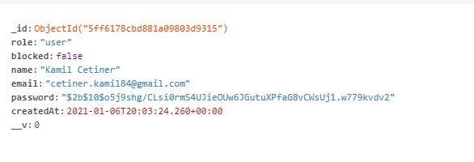
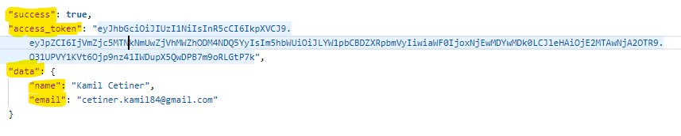

<h1 align="center">Users and Authentication</h1>


## Description

=> Mit diesem Projekt haben wir JSON WEB TOKEN(JWT) mit Hilfe von Express JS erstellt. 

=> Mit JWT haben wir  "Sign In", "Sign Out", "Forget Password" Operationen erstellt.

=> Mit NODEMAILER Package haben wir einen Link gesendet, um ein neues E-Mail-Passwort für unsere Mail zu erstellen. 
Außerdem haben wir unsere alte E  Mail gelöscht.

=> Wir haben unsere JWTs Cookies aufgenommen.

=> Mit Hilfe von Mongo Shell haben wir Daten zur Mongo DB-Datenbank hinzugefügt, Abfragen, Aktualisierungen und andere Vorgänge durchgeführt.


## These are short photo introduction about this app.


<br>
<br>

<br>
<br>

<br>
<br>

<br>
<br>

<br>
<br>



### At the end of the project, following topics are to be covered;

- Nodejs,

- Mongo DB,

- Mongo Shell

## How To Use

To clone and run this application, you'll need [Git](https://git-scm.com) and [Node.js](https://nodejs.org/en/download/) (which comes with [npm](http://npmjs.com)) installed on your computer. From your command line:

```bash

$ git clone https://github.com/KamilCetiner/Questions---Answers---Rest-Api-Project.git


```
## PACKAGES

```bash

$ npm install express

$ npm install bcryptjs

$ npm install dotenv

$ npm install express-async-handler

$ npm install jsonwebtoken

$ npm install mongoose

$ npm install nodemailer


```

## Contact

- GitHub [@Kamil](https://github.com/KamilCetiner)
- Linkedin [@Kamil](https://www.linkedin.com/in/kamil-%C3%A7etiner-b09a601ab/)